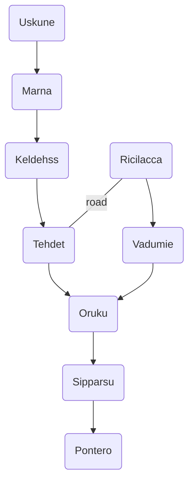

The Lysarian League is located on the eastern half of the alluvial plain of [[Narhia]] in the Isle of [[Maehlorn]]. It is primarily made up of city-states situated along the [[Lysar River]] It was founded by [[Eramepi]] of [[Marna]] following the events of the Unification War. 

Following Eramepi's death, his sister [[Valentia]] ascended the throne to become Sovereign. 

### Travel Map 

